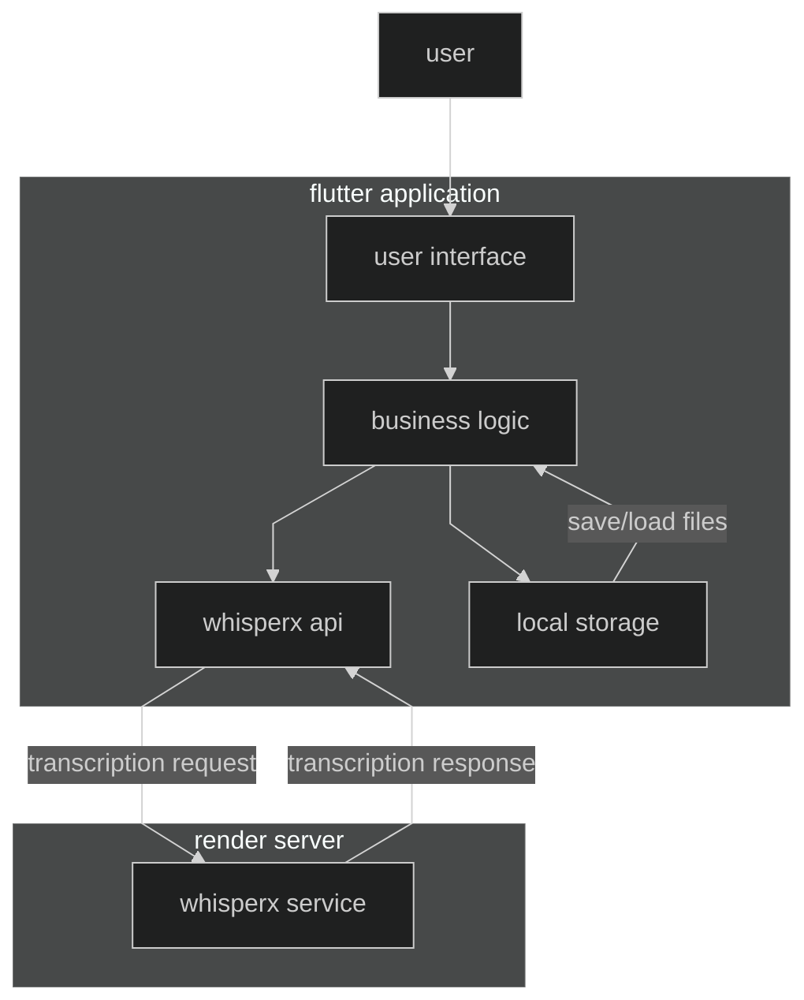
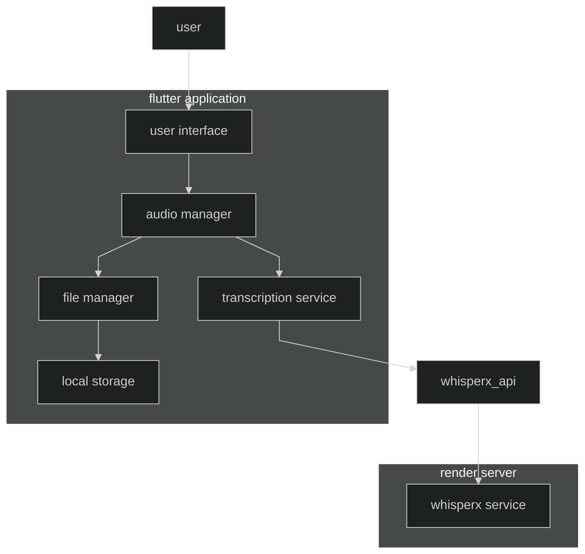
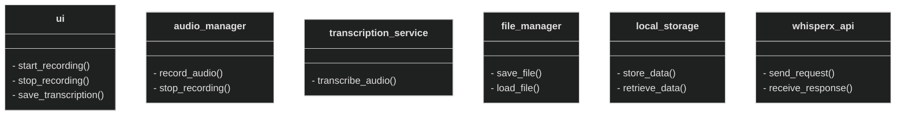
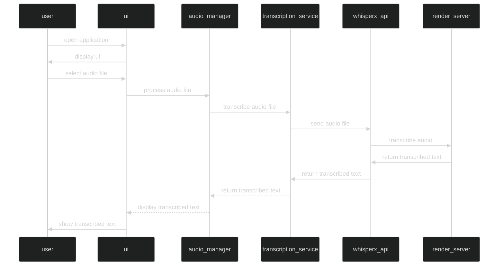
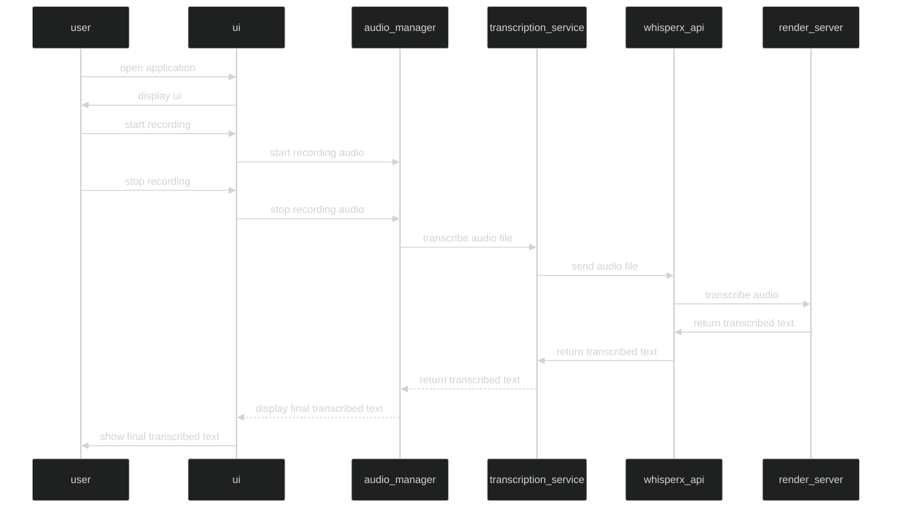
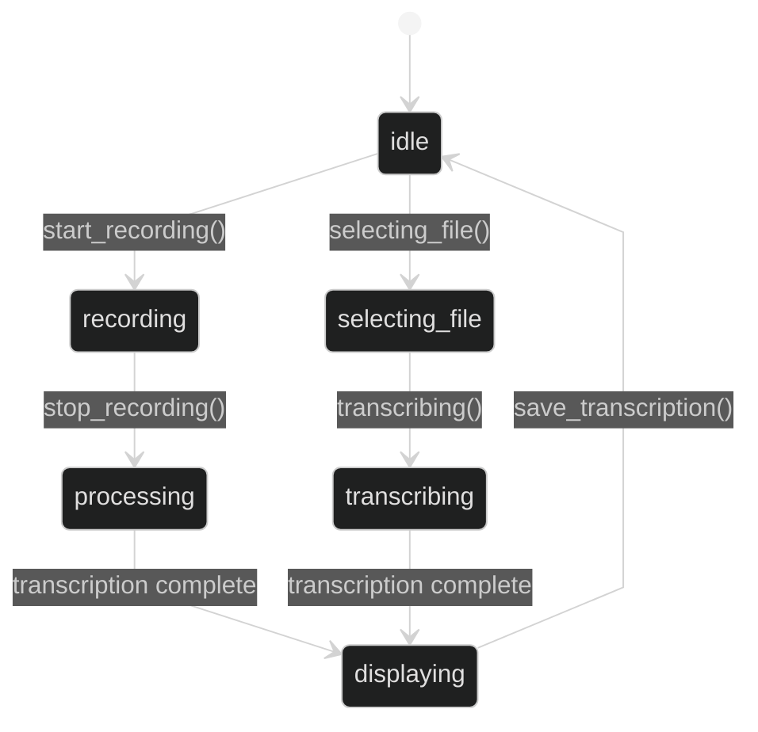

## introduction
this document provides a comprehensive analysis and design for whisperx.

## system overview

### general description
the system is designed to provide transcription services for audio files and audio recording. it aims to assist users by converting spoken words into text, facilitating the creation of written records of audio content. the system also allows users to save both transcribed text and recorded audio files locally.

### system architecture
the system is built using flutter for cross-platform mobile development, and utilizes whisperx for transcription services on a remote server running in render. the app is designed to run on both android and ios platforms.

## high-level design

### architecture diagram

### components diagram

### interfaces

- **user interface (ui)**: provides the front-end components for user interactions.
- **audio manager**: handles audio recording and playback functionalities.
- **transcription service**: interfaces with whisperx to transcribe audio.
- **file manager**: manages the saving and loading of audio and text files.
- **local storage**: provides the mechanism for storing files on the device.
- **whisperx api**: sends transcription requests to the whisperx service on the render server.
- **render server**: remote server hosting the whisperx service.

## detailed design

### class diagram

### sequence diagrams

#### rq01 sequence

#### rq02 sequence

### state diagram

### user interface design

- **home screen**: features a large microphone icon in the center, an open icon in one corner, and the app name in the other corner. when recording, the animation shows audio levels in form of waves.
- **transcription screen**: shows the transcribed text with option to save.

### technical considerations

### platform and environment
- **platforms**: android and ios
- **environment**: developed using flutter, integrated with whisperx for transcription services hosted on render
- **server service**: render

### technologies and tools
- **flutter**: cross-platform mobile development framework
- **whisperx**: transcription model
- **emacs**: ide