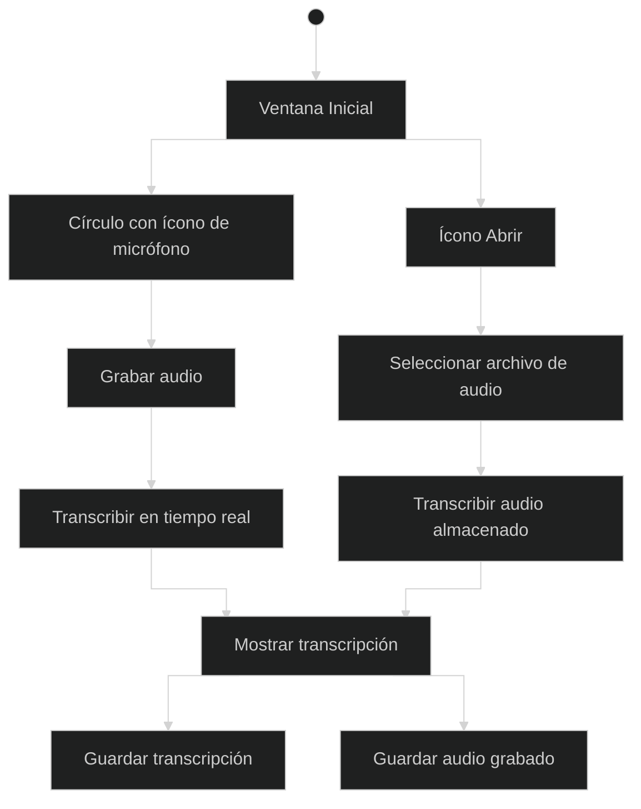

## requirements

- transcribir audio almacenado
- grabar audio y transcribirlo en tiempo real
- interfaz simple y minimalista, con modo oscuro por defecto
- guardar archivos transcritos si el usuario lo solicita
- guardar audio grabado si el usuario lo solicita
- minimizar el número de interfaces necesarias
- estilo visual similar a las notas markdown en Obsidian, con un aire a Logseq
- animaciones suaves y simples para grabación, transcripción y transiciones
- ventana inicial con las siguientes características:
  - círculo con ícono de micrófono grande en el centro de la pantalla, que muestra una animación de ondas similar a Shazam al ser activado
  - ícono en una esquina para "abrir"
  - nombre de la app en la otra esquina
- paleta de colores en tonos azules y morados
- fondo negro con un degradado morado y azul

## diagrama de casos de uso

