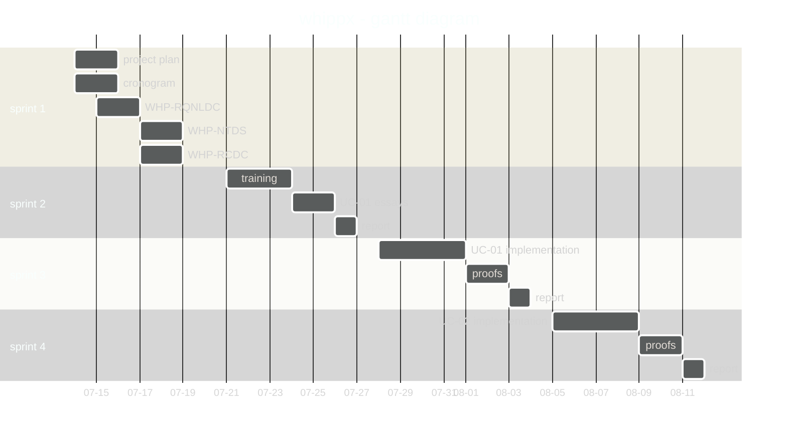

# whippx - project plan

i really doubt that i will have any other contributor other than myself, so the plan is to carry the project alone and  finish it in one month, my vacation.

## gantt diagram

this is the schedule:

