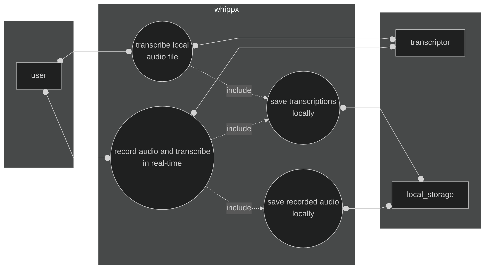
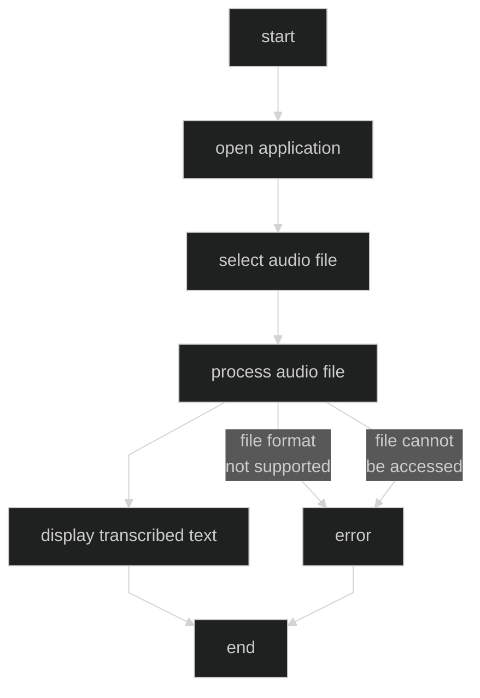
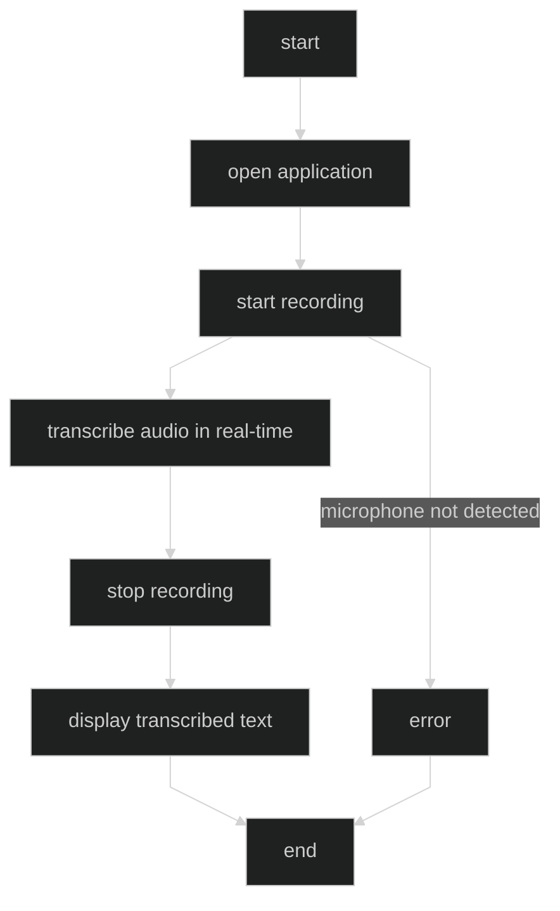
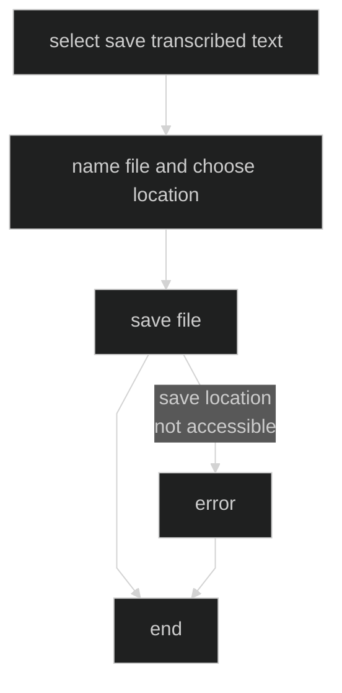

## introduction
this document is intended to offer a deep insight into what the system is needed for.

## overview

### general description
the system is designed to provide transcription services for audio files and real-time audio recording. it aims to assist users by converting spoken words into text, facilitating the creation of written records of audio content. the system also allows users to save both transcribed text and recorded audio files locally.

### users
the users of the system are individuals who need to transcribe audio content, primarily students.

## functional requirements
 
### use case diagram

### rq01 - transcribe local audio file

| description          | the application should transcribe audio files stored on the device. the user selects an audio file, and the application processes and transcribes it into text. |
| -------------------- | --------------------------------------------------------------------------------------------------------------------------------------------------------------- |
| observations         | the transcribed text should be accurate and reflect the content of the audio file. the user should be able to select from various audio file formats.           |
| priority             | high                                                                                                                                                            |
| stability            | stable                                                                                                                                                          |
| associated user type | user                                                                                                                                                            |
| actors         | user, transcriptor                                                                                                                                              |
| preconditions  | the user has audio files stored on the device.                                                                                                                  |
| postconditions | the selected audio file is transcribed into text accurately.                                                                                                    |
| basic flow     | 1. user opens the application. 2. user selects an audio file. 3. application processes the audio file. 4. application displays the transcribed text.            |
| exceptions     | 1. file format not supported. 2. file cannot be accessed.                                                                                                       |

### rq02 - record audio and transcribe in real-time

| description          | the application should record audio through the device's microphone and transcribe it in real-time. the user can start and stop recording as needed. |
| -------------------- | ---------------------------------------------------------------------------------------------------------------------------------------------------- |
| observations         | the transcription should be accurate.                                                                                                                |
| priority             | high                                                                                                                                                 |
| stability            | stable                                                                                                                                               |
| associated user type | user                                                                                                                                                 |
| actors         | user, transcriptor                                                                                                                                                         |
| preconditions  | the user has a functioning microphone.                                                                                                                                     |
| postconditions | the recorded audio is transcribed into text in real-time.                                                                                                                  |
| basic flow     | 1. user opens the application. 2. user starts recording. 3. application transcribes audio in real-time. 4. user stops recording. 5. application displays transcribed text. |
| exceptions     | 1. microphone not detected.                                                                                                                                                |

### rq03 - save transcriptions locally

| description          | the application should allow users to save the transcribed text files if requested.                                  |
| -------------------- | -------------------------------------------------------------------------------------------------------------------- |
| observations         | users should have the option to name the file and choose the save location. the saved files should be in txt format. |
| priority             | medium                                                                                                               |
| stability            | stable                                                                                                               |
| associated user type | user                                                                                                                 |
| actors         | user, local storage                                                                                                   |
| preconditions  | the user has transcribed audio with cu1 or cu2.                                                                       |
| postconditions | the transcribed text is saved as a txt file in the specified location.                                                |
| basic flow     | 1. user selects to save transcribed text. 2. user names the file and chooses location. 3. application saves the file. |
| exceptions     | 1. save location not accessible.                                                                                      |

### rq04 - save recorded audio locally

| description          | the application should allow users to save recorded audio files if requested.                                 |
| -------------------- | ------------------------------------------------------------------------------------------------------------- |
| observations         | users should have the option to name the file and choose the save location. the saved files should be in mp3. |
| priority             | medium                                                                                                        |
| stability            | stable                                                                                                        |
| associated user type | user                                                                                                          |
| actors         | user, local storage                                                                                                 |
| preconditions  | the user has recorded audio in cu2.                                                                                 |
| postconditions | the recorded audio is saved as an .mp3 file in the specified location.                                              |
| basic flow     | 1. user selects to save recorded audio. 2. user names the file and chooses location. 3. application saves the file. |
| exceptions     | 1. save location not accessible.                                                                                    |

## non-functional requirements

### rq05 - simple and minimalistic design

| description          | the application should have a simple, minimalist and dark user interface.                                                                                                 |
| -------------------- | ------------------------------------------------------------------------------------------------------------------------------------------------------------------------- |
| observations         | the interface should be intuitive and easy to navigate, with minimal distractions. dark mode should reduce eye strain and save battery life on devices with oled screens. |
| priority             | high                                                                                                                                                                      |
| stability            | stable                                                                                                                                                                    |
| associated user type | user                                                                                                                                                                      |

### rq06 - minimize number of interfaces

| description          | the application should minimize the number of user interfaces required to perform tasks.   |
| -------------------- | ------------------------------------------------------------------------------------------ |
| observations         | the goal is to simplify user interactions and reduce the steps needed to accomplish tasks. |
| priority             | medium                                                                                     |
| stability            | stable                                                                                     |
| associated user type | user                                                                                       |

### rq07 - visual style similar to markdown notes

| description          | the application's visual style should resemble markdown notes in Obsidian, with ressemblance to logseq. |
| -------------------- | ------------------------------------------------------------------------------------------------------- |
| observations         | this includes the use of simple, clean design elements and a focus on text-based interfaces when needed. |
| priority             | low                                                                                                     |
| stability            | stable                                                                                                  |
| associated user type | user                                                                                                    |

### rq08 - smooth and simple animations

| description          | the application should feature smooth and simple animations for recording, transcription, and transitions. |
| -------------------- | ---------------------------------------------------------------------------------------------------------- |
| observations         | animations should enhance the user experience without causing distraction or delay.                        |
| priority             | low                                                                                                        |
| stability            | stable                                                                                                     |
| associated user type | user                                                                                                       |

### rq09 - initial window characteristics

| description          | the initial window of the application should have a large microphone icon in the center with wave animations similar to Shazam when activated. it should also include an "open" icon in one corner and the app name in the other corner. |
| -------------------- | ---------------------------------------------------------------------------------------------------------------------------------------------------------------------------------------------------------------------------------------- |
| observations         | the design should be visually appealing and provide clear guidance on starting a recording session.                                                                                                                                      |
| priority             | medium                                                                                                                                                                                                                                   |
| stability            | stable                                                                                                                                                                                                                                   |
| associated user type | user                                                                                                                                                                                                                                     |

### rq10 - color palette and background

| description          | the application should use a color palette in shades of blue and purple, with a black background featuring a gradient of purple and blue. |
| -------------------- | ----------------------------------------------------------------------------------------------------------------------------------------- |
| observations         | the chosen colors should create a visually pleasing and cohesive look for the application.                                                |
| priority             | low                                                                                                                                       |
| stability            | stable                                                                                                                                    |
| associated user type | user                                                                                                                                      |

## system restrictions

### general restrictions

- **software compatibility**: the application should run on widely used mobile operating systems, namely Android and IOS.
- **file format support**: the application must support popular audio file formats.
- **performance constraints**: the application should process and transcribe audio files efficiently without significant delays.
